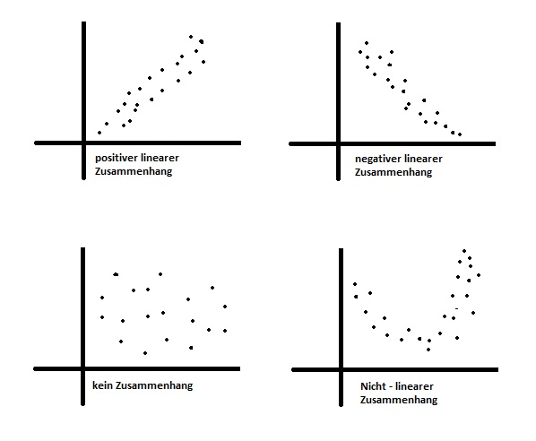

# I) Aufgabestellung

Dieses Projekt wurde im Rahmen der Fortbildung "Statistik mit R" bei dem Bildungsanbieter "alfatraining" durchgeführt.

Folgende Tests sollten anhand eines selbst ausgewählten Datensatzes durchgeführt werden:

Zusammenhangsanalyse: 

+ Korrelation nach Bravais-Pearson 

Unterschiedsanalyse:

+ t-Test für unabhängige Stichproben
+ t-Test für abhängige Stichproben
+ Einfaktorielle Varianzanalyse (ohne Messwiederholung)

Die Bearbeitungszeit betrug zwei Tage.
Die Aufgaben wurden durch ein Team von vier Personen bearbeitet.


# II) Allgemeine Studienbeschreibung

In der vorliegenden Studie beschäftigen wir uns mit der Kriminalität in den USA. Hierbei hat uns insbesondere interessiert:<br>

+ Zusammenhänge in der Gewaltrate in Bezug auf das Realeinkommen pro Kopf (Korrelation nach Bravais-Pearson ).
+ Unterschiede in der Gewaltrate, wenn es ein Gesetz im jeweiligen US Bundesstaat gibt, welches das Tragen von Waffen in der Öffentlichkeit erlaubt (t-Test für unabhängige Stichproben).
+ Unterschiede in der Gewaltrate in Bezug auf das Wahlverhalten (Einfaktorielle Varianzanalyse).
+ Signifikante Anstiege in der Inhaftierungsrate zwischen den Jahren 1979 und 1999 (t-Test für abhängige Stichproben).

Um diese Fragen zu beantworten haben wir uns für den Datensatz "Guns" des RStudio Packetes "AER" entschieden. Das Wahlverhalten je Bundesstaat wurde dem Datensatz "presidentialElections" aus dem der Library "pscl" entnommen.

Der "Guns" Datensatz enthält Daten eines balancierten Panels mit Daten aus den 50 US Bundesstaaten sowie des Districts "Columbia" (insgesamt 51 Staaten) zu den Jahren 1977 bis 1999. Der presidentialElections Datensatz beinhaltet Daten zum Anteil der für die demokratische Partei abgegebenen Stimmen in den Jahren 1932 bis 2016 je Bundesstaat sowie des Districtss "Columbia".

Folgende Variablen wurden im Datensatz verwendet:

+ income (Realeinkommen pro Kopf je US Staat) -> verhältnisskaliert
+ law (Hat der Staat ein Gesetz, welches das öffentliche Tragen von Waffen in dem betreffenden Jahr erlaubt) -> nominalskaliert
+ prisoners (verurteilte Häftlinge je 100.000 Einwohner) -> verhältnisskaliert
+ violent (Rate der Gewalttaten = Vorfälle je 100.000 Einwohner) -> verhältnisskaliert
+ demVote (Anteil der für die Demokraten abgegebenen Stimmen) -> verhältnisskaliert
+ year (Jahr 1979 vs. 1999) -> intervallskaliert, im Subset ordinalskaliert

# III) Bibliotheken & Datenimport

**Bibliotheken**

```{r}
library(dplyr) 
library(ggplot2) 
library(car) 
library(psych) 
library(effectsize)
library(tidyverse)
```
**Datenimport**

```{r}
guns <- read.csv('Guns.csv')
head(guns)
```
```{r}
elec <- read.csv("presidentialElections.csv")
head(elec)
```


# IV) Explorative Datenanalyse und Datenbereinigung

Bei der ersten Auftragung der Daten fiel direkt auf, dass es eine Reihe von Daten gab, die im allgemeinen Scatterplot der in Frage kommenden abhängigen und unabhängigen Variablen sehr auffiel. Dieser Datensatz wurde als die Daten von Washington, DC identifiziert und ist im folgenden bereits pink eingefärbt, um die Auffäligkeit zu demonstrieren. Einzig beim Einkommen sind die Daten nicht als klare Ausreißer zu erkennen.

```{r Scatterplot alle vs DC 4, fig.width=10}
#Benötigt CAR
scatterplotMatrix(~violent+prisoners+income+year | (state=="District of Columbia"),
regLine=TRUE,
smooth=FALSE,
diagonal=list(method="density"),
by.groups=TRUE,
data=guns) #Achtung hier liegt die Tabelle
```

Washington, DC stellt im Konstrukt der Vereinigten Staaten von Amerika als Bundesdistrikt eine Besonderheit dar. Der Distrikt ist kein Bundesstaat und ist keinem zugehörig und direkt der Regierung unterstellt. Das erklärt die Sonderrolle.

Im folgenden Trennen wir die Daten vom "District of Columbia" daher aus dem Datensatz heraus und arbeiten in allen Aufgaben ohne sie weiter, da wir eine Vergleichbarkeit nicht für gegeben halten.

```{r Abtrennung von DC}
gun_mod <- guns[!(guns$state == "District of Columbia"),]
gun_dc <- guns[(guns$state == "District of Columbia"),]
```

**Verteilungen ohne District Columbia**

```{r}
scatterplotMatrix(~violent+income+prisoners+year,
smooth=FALSE,
diagonal=list(method="density"),
data=gun_mod) 
```
```{r}
guns <- guns[!(guns$state == "District of Columbia"),]
```

ID Spalte in guns und elec für inner join anlegen
```{r}
guns <- guns %>% 
  unite("ID", year,state, sep="_")

elec <- elec %>% 
  unite("ID", year, state, sep="_")
```

Zusammenführung der beiden Datensätze anhand der ID
```{r}
gun_merge <- inner_join(guns, elec, by = "ID")

describe(gun_merge)
```

**Kategorisierung der Variable demVote**

Im Datensatz presidentialElections (library pscl) sind nur die demokratischen Stimmen erfasst, Stimmen für Drittkandidaten und ungültige Stimmen werden so dem konservativen Lager zugerechnet. Zudem wählen dicht besidelte Staaten tendenziell eher liberal, Flächenstaaten eher konservativ. Aus diesen Gründen wurde bei der Kategorisierung der Variable demVote eine leicht Verschiebung hin zu 'liberal' gewählt.

```{r}
hist(gun_merge$demVote, main="Hist. der dem. Stimmen", xlab="Anteil der demokratischen Stimmen", ylab="Anzahl")
```

Auch das Historgamm oben zeigt, dass es eine Konzentration der Stimmen für die Demokraten im Bereich zwischen 40% und 50% gibt.

```{r}
gun_merge$statetype <- 
  case_when((gun_merge$demVote <= 40.0) ~ 'conservative',
            (gun_merge$demVote > 40.0) & (gun_merge$demVote < 50.0) ~ 'moderate', 
            (gun_merge$demVote >= 50.0) ~ 'liberal')
length(grep('conservative', gun_merge$statetype))
length(grep('moderate', gun_merge$statetype))
length(grep('liberal', gun_merge$statetype))
```

Zudem wurden alle Datensätze aus dem Datensatz Guns entfernt, in denen keine Präsidentschaftswahlen stattgefunden haben. Der Datensatz Guns wurde also um ca. 75% reduziert.

Sortierung der Daten nach statetype
```{r}
gun_merge$statetype <- factor(gun_merge$statetype, levels=c("liberal", "moderate", "conservative"))
```

<br>
<br>
<br>

# V) Aufgaben

# 1) Korrelation nach Bravais-Pearson 

| Datensatz: |  guns (library AER) |
|---|---|
|Var1|income (Realeinkommen pro Kopf je US Staat)|
|Var2|violent (Rate der Gewalttaten = Vorfälle je 100.000 Einwohner)|


Wir wollen prüfen, ob es einen Zusammenhang zwischen dem Realeinkommen pro Kopf und der Rate der Gewalttaten gibt.

## 1.1)	Hypothese 

+ Ho: Es gibt keinen Zusammenhang zwischen dem Realeinkommen pro Kopf (income) und der Rate der Gewalttaten (violent).<br>
$$r = 0$$
+ H1: Es gibt einen Zusammenhang zwischen dem Realeinkommen pro Kopf  (income) und der Rate der Gewalttaten (violent).<br>
$$r \neq 0$$

## 1.2)	Voraussetzungen

+ Die Variablen sind mindestens intervallskaliert -> **Ja, beide Varibalen sind verhältnisskaliert.**
+ Die Variablen sind normalverteilt (n>30)-> **Ja, siehe Histogramm**
+ Der untersuchte Zusammenhang zwischen den Variablen muss linear sein -> **Ja, siehe Streudiagramm**

## 1.3)	Grundlegende Konzepte 

Die Korrelation, auch bivariate Korrelation oder Produkt-Moment-Korrelation genannt, beschreibt den Zusammenhang von zwei intervallskalierten Merkmalen/Variablen einer Zufallsstichprobe. Eine Möglichkeit, die Stärke des Zusammenhangs zu bestimmen, ist die Berechnung des Korrelationskoeffizienten r nach Bravais und Pearson. Voraussetzung ist hierbei, dass es sich um einen linearen Zusammenhang zwischen den analysierten Merkmalen handelt. Zusätzlich wird hier ein ungerichteter Zusammenhang untersucht, d.h. die Variablen sind unabhängig voneinander und folglich werden keine kausalen Aussagen gemacht.

Der Korrelationskoeffizient r kann Werte zwischen -1 und +1 annehmen und ist unabhängig von der Maßeinheit. Ein Wert von -1 beschreibt eine perfekt negative Korrelation und ein Wert von +1 eine perfekt positive Korrelation. Bei r = 0 liegt kein linearer Zusammenhang zwischen den Variablen vor. 

```{r figurename, echo=FALSE, fig.cap="Entscheidungsweg", out.width = '90%'}

```

Achtung: Es kann dennoch ein Zusammenhang bestehen. Dieser ist dann allerdings nicht linear, sondern z.B. exponentiell. Um dies zu prüfen, müssen dann andere Tests angeschlossen werden.

Bei einer Korrelation wird der ungerichtete lineare Zusammenhang zweier Variablen untersucht. "Ungerichtet" bedeutet, dass nicht von einer abhängigen und einer unabhängigen Variable gesprochen wird. Es werden folglich keine kausalen Aussagen gemacht.

Es besteht das Risiko einer Scheinkorrelation.

Die Fragestellung einer Korrelation wird oft so verkürzt:
**"Gibt es einen Zusammenhang zwischen zwei Variablen?"** 


## 1.4)	Deskriptive Statistik

Subset Erstellung für eine bessere Übersichtlichkeit

```{r}
gun_pearson <- gun_mod[,c("income", "violent")]
head(gun_pearson)
```

```{r}
describe(gun_pearson)
```

Im Mittel liegt die das Realeinkommen pro Kopf bei 13622.84 US Dollar pro Jahr (SD = 2440.78, n = 1150)). Die Rate der Gewalttaten in Vorfällen je 100.000 Einwohner liegt durchschnittlich bei 472.16 Vorfällen pro Jahr (SD = 247.02, n = 1150).

## 1.5)	Grafische Veranschaulichung des Zusammenhangs

### Histogramme

```{r}
x <- gun_mod$income 

h<-hist(x, breaks=, col="lightblue", xlab="Realeinkommen pro Kopf",
main="Verteilung Realeinkommen pro Kopf",
ylab= "Anzahl")
xfit<-seq(min(x),max(x),length=40)
yfit<-dnorm(xfit,mean=mean(x),sd=sd(x))
yfit <- yfit*diff(h$mids[1:2])*length(x)
lines(xfit, yfit, col="blue", lwd=2) 
```

Die Variable "income" ist augenscheinlich normalverteilt. Sie zeigt eine bauchige Mitte und geht an den Rändern gegen null. Auch die Stichprobengröße mit n>30 spricht dafür. 

```{r}
x <- gun_mod$violent 

h<-hist(x, breaks=, col="lightblue", xlab="Rate der Gewalttaten",
main="Verteilung Rate der Gewalttaten",
ylab= "Anzahl")
xfit<-seq(min(x),max(x),length=40)
yfit<-dnorm(xfit,mean=mean(x),sd=sd(x))
yfit <- yfit*diff(h$mids[1:2])*length(x)
lines(xfit, yfit, col="blue", lwd=2) 
```
Die Variable "violent" ist augenscheinlich normalverteilt. Sie zeigt eine bauchige Mitte und geht an den Rändern gegen null. Auch die Stichprobengröße mit n>30 spricht dafür. 

### Scatterplot

```{r}
ggplot(gun_mod, aes(x = income, y = violent)) + geom_point(size = 2, col = "cadetblue") + geom_smooth(method = "lm", col = "cornflowerblue")
```

Die Punktwolke des Streudiagramms ist breit aufgefächert. Dennoch zeigt das Streudiagramm eine tendenziell positive lineare Beziehung zwischen den beiden Variablen. Das heisst, die beiden Variablen korrelieren vermutlich. 

## 1.6)	Ergebnisse der Korrelationsanalyse

```{r}
test <- cor.test(gun_pearson$income, gun_mod$violent)
test
```
Der R-Output in Abbildung gibt den Korrelationskoeffizienten sowie den p-Wert (Signifikanz) und die Stichprobengrösse n wieder. 
Es liegt ein signifikanter, positiver-linearer Zusammenhang zwischen dem Realeinkommen pro Kopf und der Rate der Gewalttaten vor (r = .3011, p < 2.2e-16, n = 1150). 

Da r einen positiven Wert aufweist, kann von einem positiven linearen und signifikanter Zusammenhang zwischen dem Realeinkommen pro Kopf und der Rate der Gewalttaten ausgegangen werden. Das bedeutet: Je höher das Realeinkommen, detso höher die Rate der Gewalttaten. Der Zusammenhang ist inhaltlich jedoch schwer zu interpretieren. Es liegt ggf. eine Scheinkorrelation vor.

## 1.7)	Berechnung des Bestimmtheitsmasses

Aus der Korrelation lässt sich durch quadrieren das Bestimmtheitsmass berechnen:

$Bestimmtheitsmasses = r^2 *100 = {0.3011}^2*100$

```{r}
rbestimmt <- test$estimate^2*100
sprintf("Das Bestimmtheitsmaß liegt bei %.2f Prozent.", rbestimmt)
```
Wird dieser Wert mit 100 multipliziert, so ergibt sich ein Prozentwert. Dieser gibt an, welcher Anteil der Varianz in beiden Variablen durch gemeinsame Varianzanteile determiniert wird. Für das vorliegende Beispiel beträgt der Anteil der gemeinsamen Varianz 9,06%.

## 1.8)	Berechnung der Effektstärke

Um die Bedeutsamkeit eines Ergebnisses zu beurteilen, werden Effektstärken berechnet. In dieser Aufgbae ist die Korrelation der beiden Variablen signifikant, doch es stellt sich die Frage, ob der Zusammenhang gross genug ist, um ihn als bedeutend einzustufen. Der Korrelationskoeffizient r von Bravais-Pearson stellt selbst ein Mass für die Effektstärke dar.

```{r}
sprintf("Die Effektstärke liegt bei %.4f.",test$estimate)
```
Um zu bestimmen, wie gross der gefundene Zusammenhang ist, kann man sich an der Einteilung von Cohen (1992) orientieren:

$$
\begin{align}
\text{Schwacher Effekt: } 0.10 &< ||r|| < 0.30             \\
\text{Schwacher bis mittlerer Effekt: } 0.30 &= ||r||      \\
\text{Mittlerer Effekt: } 0.30 &< ||r|| < 0.50             \\
\text{Mittlerer bis starker Effekt: }0.50 &= ||r||         \\
\text{Starker Effekt: } 0.50 &< ||r||        
\end{align}
$$
Damit entspricht ein Korrelationskoeffizient(r) von .3011 einem schwachen bis mittleren Effekt.

## 1.9)	Eine Aussage

Im Mittel liegt die das Realeinkommen pro Kopf bei 13622.84 US Dollar pro Jahr (SD = 2440.78, n = 1150)). Die Rate der Gewalttaten in Vorfällen je 100.000 Einwohner liegt durchschnittlich bei 472.16 Vorfällen pro Jahr (SD = 247.02, n = 1150).

Das Realeinkommen pro Kopf je US Staat und die Rate der Gewalttaten in Vorfälle je 100.000 Einwohner in den Jahren 1977 bis 1999 korrelieren linear-positiv signifikant (r = .3011, p < 2.2e-16, n = 1150). Das Ergebnis legt nahe, dass je höher das Realeinkommen pro Kopf in einem US Staat ist, desto höher ist die Rate der Gewaltaten je 100.000 Einwohner. Der Zusammenhang ist inhaltlich jedoch schwer zu interpretieren. Es liegt ggf. eine Scheinkorrelation vor.

9,06% der Streuung der gemeinsamen Varianz kann durch das Einkommen und die Gewaltrate erklärt werden. Dabei handelt es sich nach Cohen (1992) um einen schwachen bis mittleren Effekt. 

H0 kann verworfen werden.

<br>
<br>
<br>

# 2) t-Test für unabhängige Stichproben 

| Datensatz: |  guns (library AER) |
|---|---|
|Var1|violent (Rate der Gewalttaten = Vorfälle je 100.000 Einwohner)|
|Var2|law (Hat der Staat ein Gesetz, welches das öffentliche Tragen von Waffen in dem betreffenden Jahr erlaubt)|

Wir wollen prüfen, ob es Unterschiede in der Gewaltrate gibt, wenn es ein Gesetz im jeweiligen US Bundesstaat gibt, welches das Tragen von Waffen in der Öffentlichkeit erlaubt.

## 2.1) Hypothese 
Wir wollen untersuchen ob sich die Gewaltrate durch ein Geetz, dass das Tragen einer Waffe erlaubt, beeinflusst. Hierfür gibt einen Datensatz im AER Paket, der pro Bundesstaat und Jahr (1977-1999) die Gewaltrate (violent) und die Existenz eines Gesetzes (law) zum Tragen einer Waffe dokumentiert. Folgende Hypothesen werden daz aufgestellt:

H0: Es gibt keinen Unterschied in der Gewaltrate (violent), in Abhängigkeit ob es ein Gesetz (law) gibt, welches das Tragen von Waffen erlaubt oder nicht (yes/no). <br> 
$$ M1=M2 $$
H1: Es gibt einen Unterschied in der Gewaltrate (violent), in Abhängigkeit ob es ein Gesetz (law) gibt, welches das Tragen von Waffen erlaubt oder nicht (yes/no). <br> 
$$ M_{1} \neq M_{2}\ $$

## 2.2) Voraussetzungen 

+	Die abhängige Variable ist intervallskaliert -> **Ja, die Gewaltrate ist metrisch** <br>
+	Es liegt eine unabhängige Variable vor, mittels der die beiden zu vergleichenden Gruppen gebildet werden -> **Ja, entweder ein Gesetz zum Tragen von Waffen ist erlassen (yes) oder nicht (no)** <br>
+	Das untersuchte Merkmal ist in den Grundgesamtheiten der beiden Gruppen normalverteilt -> **Ja, siehe Histogramm** <br>
+	Homogenität der Varianzen: Die Gruppen kommen aus Grundgesamtheiten mit annähernd identischer Varianz -> **Nein, siehe Levene-Test und Welch-Korrektur** <br>
+	Die einzelnen Messwerte sind voneinander unabhängig (das Verhalten einer Versuchsperson hat keinen Einfluss auf das Verhalten einer anderen) -> **Ja, entweder ein Gesetz zum Tragen von Waffen ist erlassen oder nicht** <br>

## 2.3) Grundlegendes Konzept
Der t-Test für unabhängige Stichproben testet, ob die Mittelwerte zweier unabhängiger Stichproben verschieden sind.

Die Fragestellung des t-Tests für unabhängige Stichproben wird oft so verkürzt:
**"Unterscheiden sich die Mittelwerte zweier unabhängiger Stichproben?"**

## 2.4) Deskriptive Statistiken

```{r Warning=False}
library(dplyr)

gun_mod %>%
  group_by(law) %>%
  summarise(Anzahl = n(), Mittelwert = mean(violent), Median = median(violent), Standardabweichung = sd(violent)) %>%
  mutate_if(is.numeric, round, 2)

```
Es zeigt sich für diese Fragestellung einen Mittelwertsunterschied. Der Mittelwert der Gewaltrate ist niedriger, wenn das Tragen einer Waffen erlaubt ist (M = 381.05 SD = 266.55, n = 285), als wenn das Tragen der Waffe nicht erlaubt ist (M = 502.17 SD = 232.70, n = 865). Die zwei Gruppen sind ungleich groß.

## 2.5) Grafische Veranschaulichung der Normalverteilung
```{r}
ggplot(data=gun_mod, aes(x=violent)) +
  geom_histogram(bins=20, aes(fill=law)) +
  facet_wrap(~law) +
  theme_minimal()
```
Die Daten in den beiden Gruppen sind annährend normalverteilt und erfüllen somit die Voraussetzung für den t-Test.

## 2.6) Test auf Varianzhomogenität (Levene-Test)
```{r}
library(car)

leveneTest(gun_mod$violent, gun_mod$law, center = mean)
```
Der Levene Test ist signifikant (F(1,1148)= 4.5042 p=0.03403), damit sind die Varianzen der zwei Gruppen heterogen und die Welch-Korrektur wird angewendet.

## 2.7) Ergebnisse des t-Tests für unabhängige Stichproben
```{r}
ttest<- t.test(gun_mod$violent ~ gun_mod$law,
               var.eq = FALSE, 
               con= 0.95,     
               alt = "two.sided")

ttest
```
Die Teststatistik betraegt t = 6.8583 und der zugehörige Signifikanzwert p = 2.398e-11. Damit ist der Unterschied signifikant:
Mittelwerte der beiden Gruppen, ob ein Gesetz zum Tragen einer Waffe existiert, unterscheiden sich (t(435.51) = 6.8583, p = 2.398e-11, n= 1150)

## 2.8) Berechnung der Effektstärke
```{r Warning=FALSE}
library(effsize)

cohen.d(d = gun_mod$violent, f= gun_mod$law)
```

Cohen (1988):
$$ \begin{align}
\text{Schwacher Effekt: } 0.20 &< ||d|| < 0.50             \\
\text{Schwacher bis mittlerer Effekt: } 0.50 &= ||d||      \\
\text{Mittlerer Effekt: } 0.50 &< ||d|| < 0.80             \\
\text{Mittlerer bis starker Effekt: }0.80 &= ||d||         \\
\text{Starker Effekt: } 0.80 &< ||d||        
\end{align} $$

Die Effektstärke beträgt 0.50, dies entspricht nach Cohen (1988) einem schwachen bis mittleren Effekt.

##	2.9) Eine Aussage
Der Mittelwert der Gewaltrate ist niedriger, wenn das Tragen einer Waffen erlaubt ist (M = 381.05 SD = 266.55, n = 285), als wenn das Tragen der Waffe nicht erlaubt ist (M = 502.17 SD = 232.70, n = 865).

Levene Test ist signifikant (F(1,1148)= 4.5042 p=0.03403), damit sind die Varianzen der zwei Gruppen heterogen. Die Mittelwerte der beiden Gruppen, ob ein Gesetz zum Tragen einer Waffe existiert, unterscheiden sich signifikant (t(435.51) = 6.8583, p = 2.398e-11, n= 1150).

Die Effektstärke beträgt 0.50, dies entspricht einem schwachen bis mittleren Effekt nach Cohen (1988). 

H0 kann verworfen werden.

Das heisst, dass die Berechtigung zum Tragen einer Waffen einen Unterschied in der Gewaltrate macht.  

<br>
<br>
<br>

# 3) t-Test für abhängige Stichproben

| Datensatz: |  guns (library AER) |
|---|---|
|Var1|prisoners (verurteilte Häftlinge je 100.000 Einwohner)|
|Var2|year (Jahr 1979 vs. 1999)|

Laut "last Week Tonight" hat sich die Situation in amerikanischen Gefängnissen über die letzten Jahrzehnte sehr verschlechtert. Wir wollen überprüfen, ob das auch durch gestiegenen Inhaftiertenzahlen enstanden ist.

## 3.1)	Hypothese - gerichtet

+ H1: Die Inhaftierungsrate war im Jahr 1999 höher als im Jahr 1999. $$p1999 > p1979$$
+ H0: Die Inhaftierungsrate war im Jahr 1999 gleichhoch oder niedriger als im Jahr 1999. $$p1999 <= p1979$$


## 3.2)	Voraussetzungen des t-Tests für abhängige Stichproben

+ **AV: Skalenniveau**: Die abhängige Variable ist min. intervallskaliert. -> Ja, Inhaftierungsrate ist verhältnisskaliert.

+ **UV:Skalenniveau**: Die unabhänige Variable ist nominalskaliert. -> ja, zwei Mespunkte: 1979 und 1999.

+ **Abhängigkeit der Messungen**: Es liegen zwei verbundene Stichproben oder Gruppen vor, aber die verschiedenen Messwertpaare sind voneinander unabhängig.<br>
  1) Verbundene Stichproben: ja, da es sich um die selben US-Staaten handelt.<br>
  2) Unabhängige Messwertpaare: ja, weil es zwei zeitlich voneinander unterschiedliche Messzeitpunkte sind. 
  
+ **Normalverteilung**: 
Die Unterschiede zwischen den verbundenen Testwerten sind in der Grundgesamtheit normalverteilt (bei Stichproben > 30 sind Verletzungen unproblematisch) -> Siehe Histogramm und QQPlot
Hintergrund: Der gepaarte t-Test erwartet nicht, dass die Daten in den beiden Gruppen normalverteilt sein müssen, allerdings aber die Differenzen beider Gruppen. Genauer gesagt, bezieht sich diese Annahme auf die Residuen und nicht auf die Daten selbst. 


## 3.3)	Grundlegende Konzepte: Was ist der t-Test für abhängige Stichproben?

Der t-Test für abhängige Stichproben überprüft, ob die Mittelwerte zweier abhängiger/gepaarter Stichproben verschieden sind.

Von "abhängigen Stichproben" wird gesprochen, wenn der Messwert und ein bestimmter anderer Messwert sich gegenseitig beeinflussen. In folgende Situationen, die sich für eine verbundene Stichprobe eignen.

**Messwiederholung**:
Die Messwerte stammen von der gleichen Person z.B. Messzeitpunkt #1 verglichen mit Messzeitpunkt #2.

**Natürliche Paare**:
Die Messwerte stammen von verschiedenen Personen, die aber zusammen gehören:Ehefrau – Ehemann, Psychologe – Patient oder Zwillinge.

**Matching**:
Die Messwerte stammen ebenfalls von verschiedenen Personen, die einander zugeordnet wurden. Aufgrund eines vergleichbaren Werts (Drittvariablen) werden Matching-Paare gebildet. 

Im vorliegenden Fall handelt es sich um eine Messwiederholung.

## 3.4)	Deskriptive Statistiken 

**Erstellung Datensatz für abhängigen T-Test**

Erstellung Subset

```{r}
gun_t_ab_79_a <- gun_mod[(gun_mod$year == 1979) ,]
gun_t_ab_79 <- gun_t_ab_79_a[,c("year", "prisoners", "state")]
gun_t_ab_99_a <- gun_mod[(gun_mod$year == 1999) ,]
gun_t_ab_99 <- gun_t_ab_99_a[,c("year", "prisoners", "state")]
gun_t_ab_unsortiert <- right_join(gun_t_ab_79, gun_t_ab_99, by="state")
gun_t_ab_unsortiert
colnames(gun_t_ab_unsortiert)[2] <- "seventynine"
colnames(gun_t_ab_unsortiert)[5] <- "ninetynine"
gun_t_ab_unsortiert$year.x <- NULL
gun_t_ab_unsortiert$year.y <- NULL
gun_t_ab <- gun_t_ab_unsortiert[c("state", "seventynine", "ninetynine")]
gun_t_ab
```

Differenzzeile einfügen

```{r}
# Differenz erstellen
diff_prisoners <- gun_t_ab$ninetynine - gun_t_ab$seventynine 
diff_prisoners
```

```{r}
# Die Spalte "Differenz" wird zum Datensatz hinzugefügt
gun_t_ab <- cbind(gun_t_ab, "diff_prisoners" = diff_prisoners)
head(gun_t_ab)
```

Deskriptive Statistik

```{r}
d = describe(gun_t_ab)
d
```
Es zeigt sich, dass es einen Mittelwertsunterschied zwischen der Inhaftierungsrate des Jahre 1979 und denen des Jahres 1999 in Punkto Anzahl  gibt. Die Mittelwerte unterscheiden sich dahingehend, dass die Mittelwerte des Jahre 1979 bei 113,48 liegen (SD = 54,90, N = 50) und die des Jahres 1999 bei 366,32 (SD = 141,20, N = 50).

## 3.5) Grafische Veranschaulichung der Normalverteilung der Differenz

### Verteilung Inhaftierungsraten 1979 und 1999

```{r Scatterplot der verschiedenen Jahre}
TEMP <- scatterHist(gun_t_ab$ninetynine, gun_t_ab$seventynine,
main = "Vergleich der Inhaftierungsrate", #Überschrift 
xlab = "Inhaftierungsrate 1999", # x-Achse
ylab= "Inhaftierungsrate 1979", # y-Achse
pch=17, # Dreiecke 
col= "darkgray" , # Farbe
#ellipse = FALSE, # Keine Kreise
method = "pearson" #-0.11 ->r
)
```

Die Inhaftierungsraten für die Jahre 1979 und 1999 sind normalverteilt. Dies ist jedoch für die folgenden Tests nicht relevant. 

### Histogramm Differenz 

```{r}
hist(gun_t_ab$diff_prisoners, xlab = "Differenz zwischen den Jahren 1979 und 1999 bzgl Inhaftierungsrate", ylab = "Anzahl", main = "Histogramm der Differenz", breaks = 20, col = "steelblue3")
```

### QQPlot Differenz 

```{r}
qqPlot(gun_t_ab$diff_prisoners, main = "QQPlot für die Variable Differenz", ylab = "Differenz Häftlinge Jahre 1979 & 1999")
```

Das Histogramm und die das QQPlot zeigen, dass die Differenz der Inhaftierungsrate zwischen den Jahre 1979 und 1999 normalverteil sind. Das Histogramm zeigt keine idealtypische Normalverteilung. Im QQPlot ist dagegen deutlich zu sehen, dass bis auf drei Ausreißer alle Punkte in der relevanten Grenze liegen. Auch die Stichprobengröße mit n>30 spricht für Nomralverteilung.

### Ausreißer in der Differenzverteilung

Bei den beiden ausgewiesenen Ausreißern handelt es sich um die Staaten Louisiana und Texas.

```{r}
gun_t_ab$state[18]
gun_t_ab$seventynine[18]
gun_t_ab$ninetynine[18]
gun_t_ab$diff_prisoners[18]
```
Der Anstieg in der Inhaftierungsrate in Louisiana beträgt 552 vom Jahr 1979 (Inhaftierungsrate = 184) zum Jahr 1999 (Inhaftierungsrate = 736).

```{r}
gun_t_ab$state[43]
gun_t_ab$seventynine[43]
gun_t_ab$ninetynine[43]
gun_t_ab$diff_prisoners[43]
```
Der Anstieg in der Inhaftierungsrate in Texas beträgt 535 vom Jahr 1979 (Inhaftierungsrate = 189) zum Jahr 1999 (Inhaftierungsrate = 724).

## 3.6) Pearson Korrelation

```{r}
test <- cor.test(gun_t_ab$ninetynine, gun_t_ab$seventynine)
test
```
Die Inhaftierungsrate zwischen den Jahren 1979 und 1999 korrelieren positiv-linear signifikant (r = .715, p = .000, n = 50).

## 3.7)	Ergebnisse des t-Tests für abhängige Stichproben

```{r}
testVER<- t.test(gun_t_ab$ninetynine, gun_t_ab$seventynine, alternative = "greater", paired = TRUE, conf.level = .95) 
testVER
```

Die Teststatistik beträgt t = 16,407 und der zugehörige Signifikanzwert p = 2.2e-16. Damit ist der Unterschied signifikant: Die Mittelwerte der beiden Inhaftierungsraten (Jahr 1979 und Jahr 1999) unterscheiden sich (t(49) = 16.407, p = 2.2e-16, n= 50).

## 3.8)	Berechnung der Effektstärke

### Cohen und Pearson

$$r=\left\| \sqrt {\frac{t^2}{t^2+df}} \right\|$$
```{r}
eff1 <- abs(sqrt(testVER$statistic^2 / (testVER$statistic^2 + testVER$parameter)))
sprintf("Effektstärke: %.4f", eff1)
```

Zur Beurteilung der Groesse des Effektes dient die Einteilung von Cohen (1992):

$$
\begin{align}
\text{Schwacher Effekt: } 0.10 &< ||r|| < 0.30             \\
\text{Schwacher bis mittlerer Effekt: } 0.30 &= ||r||      \\
\text{Mittlerer Effekt: } 0.30 &< ||r|| < 0.50             \\
\text{Mittlerer bis starker Effekt: }0.50 &= ||r||         \\
\text{Starker Effekt: } 0.50 &< ||r||        
\end{align}
$$
Damit entspricht eine Effektstärke von 0.92 einem starken Effekt

### Hedges g

Alternativ zu cohen und Pearson kann auch Hedges g verwendet werden.

$$
\rm{Hedges}\ \hat{g}=\left|\frac{\hat{\mu_1}-\hat{\mu_2}}{\hat{\sigma_{d}}}\right|
$$

```{r}
diff <- testVER$estimate
sed <- sd(gun_t_ab$seventynine - gun_t_ab$ninetynine)
g <- diff/sed

sprintf("Effektstärke: %.4f",g)
```

Zur Beurteilung der Größe des Effektes:

$$
\begin{align}
\text{Schwacher Effekt: } 0.20 &< ||g|| < 0.50             \\
\text{Schwacher bis mittlerer Effekt: } 0.50 &= ||g||      \\
\text{Mittlerer Effekt: } 0.50 &< ||g|| < 0.80             \\
\text{Mittlerer bis starker Effekt: }0.80 &= ||g||         \\
\text{Starker Effekt: } 0.80 &< ||g||        
\end{align}
$$  

Damit entspricht eine Effektstärke von 2,3203 einem starken Effekt.

## 3.9)	Eine Aussage

Die Häftlingrsrate des Jahres 1999 fällt höher aus (Mean = 366,32, SD = 141,20, N = 50) als die des Jahres 1979 (Mean = 113,48, SD = 54,90, N = 50). Es liegt eine signifikant positiv-lineare Korrelation vor, die einen Trend und eine Abhängigkeit zeigt (r = 0.715, p = .000, n = 50). 

Es ergibt sich ein signifikanter Unterschied der Mittelwerte (t(49)=16.407, p < 2E-16, n= 50). Es wurde bewusst einseitig getestet und die Inhaftierungsraten sind im Jahr 1999 somit siginifikant größer.

Die Effektstärke nach Cohen (1992) liegt bei r = 0,92 und entspricht damit einem starken Effekt. Die Effektstärke nach Hedges g liegt bei Hedges g = 2,3203 und entspricht damit einem starken Effekt. 

H0 kann verworfen werden.

Eine Recherche im Internet ergibt, dass ab circa 1980 die Gefängnisse in den USA privatisiert wurden. Dies führt laut Medienberichten zu erhöhten Haftzeiten und schlechterer Resozialisierung (siehe z.B. das "Last Week Tonight"-Feature zu diesem Thema).

<br>
<br>
<br>

# 4) Einfaktorielle Varianzanalyse

| Datensatz: |  guns (library AER) |
|---|---|
|Var1|violent (Rate der Gewalttaten = Vorfälle je 100.000 Einwohner)|


| Datensatz: |  presidentialElections (library pscl)|
|---|---|
|Var2|year (Jahr 1979 vs. 1999)|

Es gibt Behauptungen, dass konservative Staaten sicherer seien als andere Staaten. Daher wollen wir untersuchen, ob wir Unterschiede finden können

## 4.1) Hypothese

+ H0: Es gibt keinen mittleren Unterschied in der Rate der Gewaltverbrechen (violent) über die politische Tendenz eines Staates (conservative, moderate, liberal) hinweg. $$M_l = M_m = M_c$$

+ H1: Es gibt einen mittleren Unterschied in der Rate der Gewaltverbrechen (violent) über die politische Tendenz eines Staates (conservative, moderate, liberal) hinweg. $$M_l \neq M_m \neq M_c$$ (für mind. einen Fall)

## 4.2) Voraussetzungen 

+ Die abhängige Variable ist intervallskaliert -> **Ja, die Rate der Gewaltverbrechen pro 100k Einwohner (violent) ist metrisch**
+ Die unabhängige Variable (Faktor) ist kategorial (nominal- oder ordinalskaliert) -> **Ja, die politische Tendenz (statetype) ist kategorial**
+ Die durch den Faktor gebildeten Gruppen sind unabhängig -> **Ja, die Staaten sind klar voneinander abgegrenzt**
+ Die abhängige Variablen ist normalverteilt innerhalb jeder der Gruppen (Ab > 25 Probanden pro Gruppe sind Verletzungen in der Regel unproblematisch) -> **Ja, siehe Histogramm**
+ Homogenität der Varianzen: Die Gruppen stammen aus Grundgesamtheiten mit annähernd identischen Varianzen der abhängigen Variablen -> **Ja, siehe Levene-Test**

## 4.3) Grundlegende Konzepte

Die einfaktorielle Varianzanalyse – auch "einfaktorielle ANOVA", da in Englisch "Analysis of Variance" – testet, ob sich die Mittelwerte mehrerer unabhängiger Gruppen (oder Stichproben) unterscheiden, die durch eine kategoriale unabhängige Variable definiert werden. Diese kategoriale unabhängige Variable wird im Kontext der Varianzanalyse als "Faktor" bezeichnet. Entsprechend werden die Ausprägungen der unabhängigen Variable "Faktorstufen" genannt, wobei auch der Begriff der "Treatments" gebräuchlich ist. Als "einfaktoriell" wird eine Varianzanalyse bezeichnet, wenn sie lediglich einen Faktor, also eine Gruppierungsvariable, verwendet mehrfaktorielle Varianzanalyse).

Das Prinzip der Varianzanalyse besteht in der Zerlegung der Varianz der abhängigen Variable. Die Gesamtvarianz setzt sich aus der sogenannten "Varianz innerhalb der Gruppen" und der "Varianz zwischen den Gruppen" zusammen. Diese beiden Anteile werden im Rahmen einer Varianzanalyse miteinander verglichen. Die einfaktorielle ANOVA stellt eine Verallgemeinerung des t-Tests für unabhängige Stichproben für Vergleich von mehr als zwei Gruppen (oder Stichproben) dar. 

Die Fragestellung der einfaktoriellen Varianzanalyse wird oft so verkürzt: **"Unterscheiden sich die Mittelwerte einer unabhängigen Variable zwischen mehreren Gruppen? Welche Faktorstufen unterscheiden sich?"**

## 4.4) Deskriptive Statistik

Die Tabelle in Abbildung gibt die Mittelwerte, Standardabweichungen und Grössen aller vier Gruppen wieder. Diese Informationen werden für die Berichterstattung verwendet.

```{r}
gun_merge %>%
  group_by(statetype) %>%
  summarize(Anzahl = n(), Mittelwert = mean(violent), Median = median(violent), Standardabweichung = sd(violent)) %>%
  mutate_if(is.numeric, round, 3)
```

Zwischen den den drei verschiedenen Gruppen gibt es zwar Mittelwertsunterschiede, aber die Standardabweichungen sind sehr hoch. Die kleinste Gruppe der liberalen Staaten liegt bei der Gewaltverbrechensrate in der Mitte (Mittelwert=495.21, STD=267.3, n=30), die moderaten Staaten haben die höchste GVR (Mittelwert=512.38, STD=252.17, n=125) und die konservative Staaaten sind am unteren Ende (Mittelwert=433.76, STD=240.98, n=95).

## 4.5) Grafische Veranschaulichung der Normalverteilung

### Boxplot
```{r fig.height=6, fig.width=11}
boxplot(gun_merge$violent ~ gun_merge$statetype, 
        main = "Boxplots zum Vergleich", 
        ylab = "Verbrechensrate", 
        xlab= "politische Tendenz", 
        col = c("lightgreen", "deepskyblue", "tomato"))
```

Der Boxplot zeigt, dass es kaum Ausreißer gibt. Allerdings lassen sich die Verteilungen auch nicht eindeutig voneinander zu unterscheiden.

### Histogramme

**Base**
```{r fig.height=6, fig.width=11}
gun_merge %>%
  group_by(statetype) %>%
  ggplot(aes(violent, color = statetype)) +
  geom_histogram(aes(fill = statetype), bins = 20) +
  facet_wrap(~statetype) +
  theme_grey() +
  labs(x = 'Verbrechensrate', y = 'politische Tendenz')
```

Die Daten sind annähernd normalverteilt, wenn auch im Falle von 'liberal' nicht ganz so schön.

### QQPlot
```{r fig.height=6, fig.width=11}
qqPlot(violent ~ statetype, data = gun_merge, 
       layout=c(1, 3))
```

Im QQplot lässt sich auch eine annähernde Normalverteilung ablesen.


## 4.6) Prüfung der Varianzhomogenität (Levene-Test)

Der Levene-Test prüft für die Nullhypothese, dass die Varianzen der Gruppen sich nicht unterscheiden. Ist der Levene-Test nichtsignifikant, so kann von homogenen Varianzen ausgegangen. Wäre der Levene-Test jedoch signifikant, so wäre eine der Grundvoraussetzungen der Varianzanalyse verletzt. Gegen leichte Verletzungen gilt die Varianzanalyse als robust; vor allem bei genügend grossen und etwa gleich grossen Gruppen sind Verletzungen nicht problematisch. Bei ungleich grossen Gruppen führt eine starke Verletzung der Varianzhomogenität zu einer Verzerrung des F-Tests. Alternativ können dann auf den den Welch-Test zurückgegriffen werden. Dabei handelt es sich um adjustierte F-Tests.

```{r}
leveneTest(gun_merge$violent ~ gun_merge$statetype, center = 'mean')
```

Im vorliegenden Beispiel ist der Levene-Test nicht signifikant (F(2, 247) = .5213, p = .5944), so dass von **Varianzhomogenität** ausgegangen werden kann. Es wir keine Welch-Korrektur durchgeführt.

## 4.7) Ergebnisse der einfaktoriellen Varianzanalyse ohne Messwiederholung

**ohne Welch-Korrektur**

```{r}
gun_aov <- aov(data = gun_merge, violent ~ statetype)
summary(gun_aov)
```

Das Gesamtmodel ist nicht signifikant geworden (F(2, 247) = 2.732 , p = .067). An dieser Stelle ist eine weitere Analyse eigentlich nicht notwendig. Aus Gründen der Übung und Vollständigkeit soll jedoch der Test vollständig durchgeführt werden.

## 7) Post-hoc-Tests

Obwohl der F-Test zeigt, dass das Gesmatmodell nicht signifikant geworden ist, soll an dieser Stelle dennoch ein Post-Hoc-Test durchgeführt werden. Der Post-Hoc soll eigentlich zeigen, zwischen welchen Faktorstufen (politische Tendenz) signifikante unterscheide bezüglich der Kriminalitätsrate bestehen.

$$\frac{k\cdot(k-1)}{2} =\frac{3\cdot(3-1)}{2} = \frac{6}{2} = 3$$

Bei der Berechnung von Post-hoc-Tests wird im Prinzip für jede Kombination von zwei Mittelwerten ein t -Test durchgeführt. Im aktuellen Beispiel mit drei Gruppen sind dies 3 Tests. Multiple Tests sind jedoch problematisch, da der Alpha-Fehler (die fälschliche Ablehnung der Nullhypothese) mit der Anzahl der Vergleiche steigt.

Wird nur ein t-Test mit einem Signifikanzlevel von .05 durchgeführt, so beträgt die Wahrscheinlichkeit des Nicht-Eintreffens des Alpha-Fehlers 95 Prozent. Werden jedoch drei solcher Paarvergleiche vorgenommen, so beträgt die Nicht-Eintreffens-Wahrscheinlichkeit des Alpha-Fehlers (.95)^3 = .857. Um die Wahrscheinlichkeit des Eintreffens des Alpha-Fehlers zu bestimmen, wird 1 - .857 = .143 gerechnet. Die Wahrscheinlichkeit des Eintreffens des Alpha-Fehlers liegt somit bei 14.3 Prozent. Diese Fehlerwahrscheinlichkeit wird als “Familywise Error Rate” bezeichnet.

Um dieses Problem zu beheben kann zum Beispiel der Tukey angewendet werden. RStudio rechnet das neue Niveau ein, daher können wir weiter auf 0.05 testen.

**Tukey**
```{r}
TukeyHSD(aov(data = gun_merge, violent ~ statetype))
```

Es wird ersichtlich, dass sich die politische Tendenz in einem Staat für keine der 3 Gruppen signifikant unterscheidet (p < .05). Es können keine unabhängigen / generalisierbaren Gruppen gebildet werden.

```{r}
pairwise.t.test(gun_merge$violent, gun_merge$statetype, 
p.adjust.method = "bonferroni", 
paired = FALSE, 
data = gun_merge)
```

Auch mit dem pairwise.t.test mit Bonferroni-Korrektur kommt man zum selben Ergebnis.

## 8) Profildiagramm

Das Profildiagramm kann ein klares visuelles Bild der Gruppen vermitteln.

```{r fig.height=6, fig.width=11}
ggplot(gun_merge, aes(x = statetype, y = violent, group = 1, color = statetype)) +
  stat_summary(fun = mean, geom = 'point', size = 3) +
  stat_summary(fun = mean, geom = 'line') +
  stat_summary(fun.data = mean_cl_normal, geom = "errorbar", width = .2, size = .25) +
  labs(x = 'politische Tendenz', y = 'Kriminalitätsrate', title = 'Profildiagramm - Kriminalitätsrate vs. politische Tendenz') +
  #ggtitle('Profildiagramm - Kriminalitätsrate vs. politische Tendenz') +
  theme_classic()
```

## 9) Das partielle Eta-Quadrat

Das partielle Eta-Quadrat (auch partielles $\eta^2$ oder $\eta^2_p$) ist ein Mass für die Effektgrösse: Es setzt die Variation, die durch einen Faktor erklärt wird, in Bezug mit jener Variation, die nicht durch andere Faktoren im Modell erklärt wird. Das heisst, es wird ausschliesslich jene Variation betrachtet, welche nicht durch die anderen Faktoren im Modell erklärt wird. Das partielle Eta-Quadrat zeigt, welchen Anteil davon ein Faktor erklärt. Im Falle der einfaktoriellen Varianzanalyse ist das partielle Eta-Quadrat jener Anteil der korrigierten Gesamtvariation, der durch das Modell erklärt wird.

```{r}
gun_eta <- eta_squared(gun_aov, partial = TRUE)
gun_eta
```

Hinweis: Im vorliegenden Beispiel beträgt das partielle Eta-Quadrat .02. Das heisst, es wird 2% der Variation in der Kriminalitätsrate durch die politische Tendenz aufgeklärt. “90% CI” beschreibt das Konfidenzintervall für 90 %. Dieses liegt hier zwischen 0% und 6%.

## 10) Berechnung der Effektstärke
```{r}
gun_eff <- sqrt(gun_eta$Eta2 / (1 - gun_eta$Eta2))
gun_eff
```

Um zu beurteilen, wie gross dieser Effekt ist, kann man sich an der Einteilung von Cohen (1988) orientieren:
$$
\begin{align}
\text{Schwacher Effekt: } 0.10 &< ||f|| < 0.25             \\
\text{Schwacher bis mittlerer Effekt: } 0.25 &= ||f||      \\
\text{Mittlerer Effekt: } 0.25 &< ||f|| < 0.40             \\
\text{Mittlerer bis starker Effekt: }0.40 &= ||f||         \\
\text{Starker Effekt: } 0.40 &< ||f||        
\end{align}
$$

Die Effektstärke beträgt 0.15. Da kein signifikanter Unterschied vorliegt, ist auch kein Effekt vorhanden.

## 11) Eine Aussage

Im vorliegenden Beispiel gibt es **keinen Haupteffekt** - die politische Tendenz in einem Staat hat keinen signifikanten Einfluss auf die Kriminalitätsrate (F(2, 247) = 2.732 , p = .067) - obwohl sich in der deskriptiven Statistik Mittelwertsunteschiede zeigen: conservative (M = 433.76, SD = 240.98, n = 95), moderate (M = 512.38, SD = 252.17, n = 125) und liberal (M = 495.21, SD = 267.30, n = 30). Lediglich 2 % der Streuung der Kriminalitätsrate um den Gesammtmittelwert kann durch die politische Tendenz in einem Staat erklärt werden. **Gäbe es einen Haupteffekt**, läge für diesen Fall nach Cohen (1988) mit f = .15 lediglich ein schwacher Effekt vor. Da jedoch kein Haupteffekt vorliegt, der auf die Population übertragen werden kann, wird dieser schwache Effekt hier als kein Effekt angesehen. 

H1 wird verworfen, H0 wird beibehalten.

Wie fast zu erwarten zeigt der Post-Hoc-Test mit Tukey, dass sich keine Gruppen bilden lassen (alle p > .05). Der Vollständigkeit halber wurde er im Rahmen dieser Übung dennoch durchgeführt.

<br>
<br>
<br>

# VI) Zusammenfassung

## 1) Zusammenhang Realeinkommen pro Kopf und Rate der Gewalttaten (Korrelation nach Bravais-Pearson)

**Hypothesen**

+ Ho: Es gibt keinen Zusammenhang zwischen dem Realeinkommen pro Kopf (income) und der Rate der Gewalttaten (violent).
+ H1: Es gibt einen Zusammenhang zwischen dem Realeinkommen pro Kopf (income) und der Rate der Gewalttaten (violent).

**Aussage zum Ergebnis**

Im Mittel liegt die das Realeinkommen pro Kopf bei 13622.84 US Dollar pro Jahr (SD = 2440.78, n = 1150)). Die Rate der Gewalttaten in Vorfällen je 100.000 Einwohner liegt durchschnittlich bei 472.16 Vorfällen pro Jahr (SD = 247.02, n = 1150).

Das Realeinkommen pro Kopf je US Staat und die Rate der Gewalttaten in Vorfälle je 100.000 Einwohner in den Jahren 1977 bis 1999 korrelieren linear-positiv signifikant (r = .3011, p < 2.2e-16, n = 1150). Das Ergebnis legt nahe, dass je höher das Realeinkommen pro Kopf in einem US Staat ist, desto höher ist die Rate der Gewaltaten je 100.000 Einwohner. Der Zusammenhang ist inhaltlich jedoch schwer zu interpretieren. Es liegt ggf. eine Scheinkorrelation vor.

9,06% der Streuung der gemeinsamen Varianz kann durch das Einkommen und die Gewaltrate erklärt werden. Dabei handelt es sich nach Cohen (1992) um einen schwachen bis mittleren Effekt.

H0 kann verworfen werden.

## 2) Unterschiede in der Gewaltrate gibt, wenn es ein Gesetz im jeweiligen US Bundesstaat gibt, welches das Tragen von Waffen in der Öffentlichkeit erlaubt.

**Hypothesen**

+ H0: Es gibt keinen Unterschied in der Gewaltrate (violent), in Abhängigkeit ob es ein Gesetz (law) gibt, welches das Tragen von Waffen erlaubt oder nicht (yes/no). 
+ H1: Es gibt einen Unterschied in der Gewaltrate (violent), in Abhängigkeit ob es ein Gesetz (law) gibt, welches das Tragen von Waffen erlaubt oder nicht (yes/no). 

**Aussage zum Ergebnis**

Der Mittelwert der Gewaltrate ist niedriger, wenn das Tragen einer Waffen erlaubt ist (M = 381.05 SD = 266.55, n = 285), als wenn das Tragen der Waffe nicht erlaubt ist (M = 502.17 SD = 232.70, n = 865).

Levene Test ist signifikant (F(1,1148)= 4.5042 p=0.03403), damit sind die Varianzen der zwei Gruppen heterogen. Die Mittelwerte der beiden Gruppen, ob ein Gesetz zum Tragen einer Waffe existiert, unterscheiden sich signifikant (t(435.51) = 6.8583, p = 2.398e-11, n= 1150).

Die Effektstärke beträgt 0.50, dies entspricht einem schwachen bis mittleren Effekt nach Cohen (1988). 

H0 kann verworfen werden.

## 3) Unterschiede der Gefängnisinsassen in den Jahren 1979 und 1999

**Hypothesen**

+ H1: Die Inhaftierungsrate war im Jahr 1999 höher als im Jahr 1999.
+ H0: Die Inhaftierungsrate war im Jahr 1999 gleichhoch oder niedriger als im Jahr 1999.

**Aussage zum Ergebnis**

Die Häftlingrsrate des Jahres 1999 fällt höher aus (Mean = 366,32, SD = 141,20, N = 50) als die des Jahres 1979 (Mean = 113,48, SD = 54,90, N = 50). Es liegt eine signifikant positiv-lineare Korrelation vor, die einen Trend und eine Abhängigkeit zeigt (r = 0.715, p = .000, n = 50).

Es ergibt sich ein signifikanter Unterschied der Mittelwerte (t(49)=16.407, p < 2E-16, n= 50). Es wurde bewusst einseitig getestet und die Inhaftierungsraten sind im Jahr 1999 somit siginifikant größer.

Die Effektstärke nach Cohen (1992) liegt bei r = 0,92 und entspricht damit einem starken Effekt. Die Effektstärke nach Hedges g liegt bei Hedges g = 2,3203 und entspricht damit einem starken Effekt.

H0 kann verworfen werden.

## 4) Unterschiede in der Gewaltrate in Staaten mit unterschiedlichem Wahlverhalten

**Hypothesen**

+ H0: Es gibt keinen mittleren Unterschied in der Rate der Gewaltverbrechen (violent) über die politische Tendenz eines Staates (conservative, moderate, liberal) hinweg.
+ H1: Es gibt einen mittleren Unterschied in der Rate der Gewaltverbrechen (violent) über die politische Tendenz eines Staates (conservative, moderate, liberal) hinweg.

**Aussage zum Ergebnis**

Im vorliegenden Beispiel gibt es keinen Haupteffekt - die politische Tendenz in einem Staat hat keinen signifikanten Einfluss auf die Kriminalitätsrate (F(2, 247) = 2.732 , p = .067) - obwohl sich in der deskriptiven Statistik Mittelwertsunteschiede zeigen: conservative (M = 433.76, SD = 240.98, n = 95), moderate (M = 512.38, SD = 252.17, n = 125) und liberal (M = 495.21, SD = 267.30, n = 30). Lediglich 2 % der Streuung der Kriminalitätsrate um den Gesammtmittelwert kann durch die politische Tendenz in einem Staat erklärt werden. Gäbe es einen Haupteffekt, läge für diesen Fall nach Cohen (1988) mit f = .15 lediglich ein schwacher Effekt vor. Da jedoch kein Haupteffekt vorliegt, der auf die Population übertragen werden kann, wird dieser schwache Effekt hier als kein Effekt angesehen.

H1 wird verworfen, H0 wird beibehalten.

Wie fast zu erwarten zeigt der Post-Hoc-Test mit Tukey, dass sich keine Gruppen bilden lassen (alle p > .05). Der Vollständigkeit halber wurde er im Rahmen dieser Übung dennoch durchgeführt.
